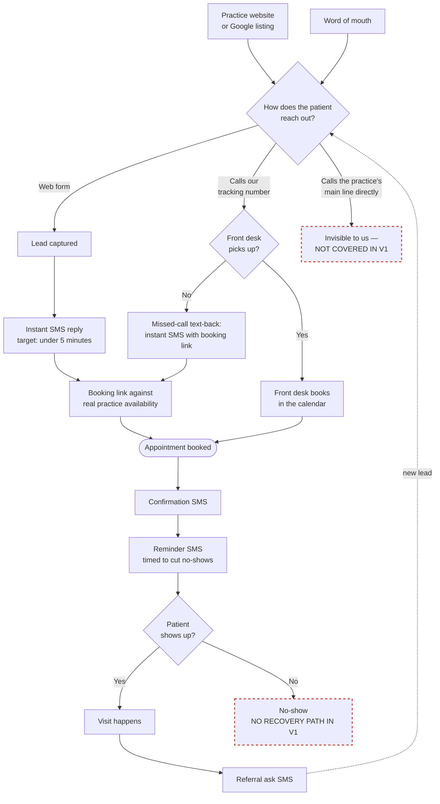
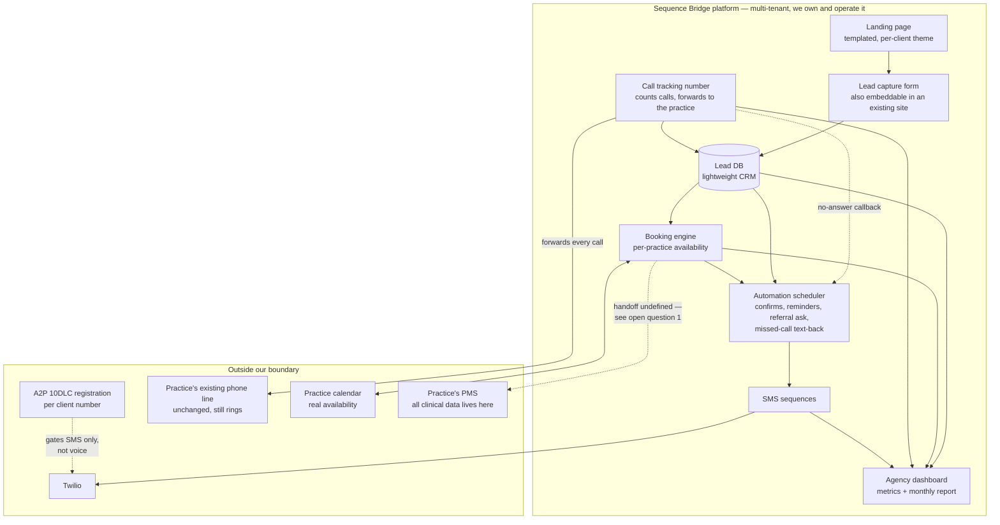
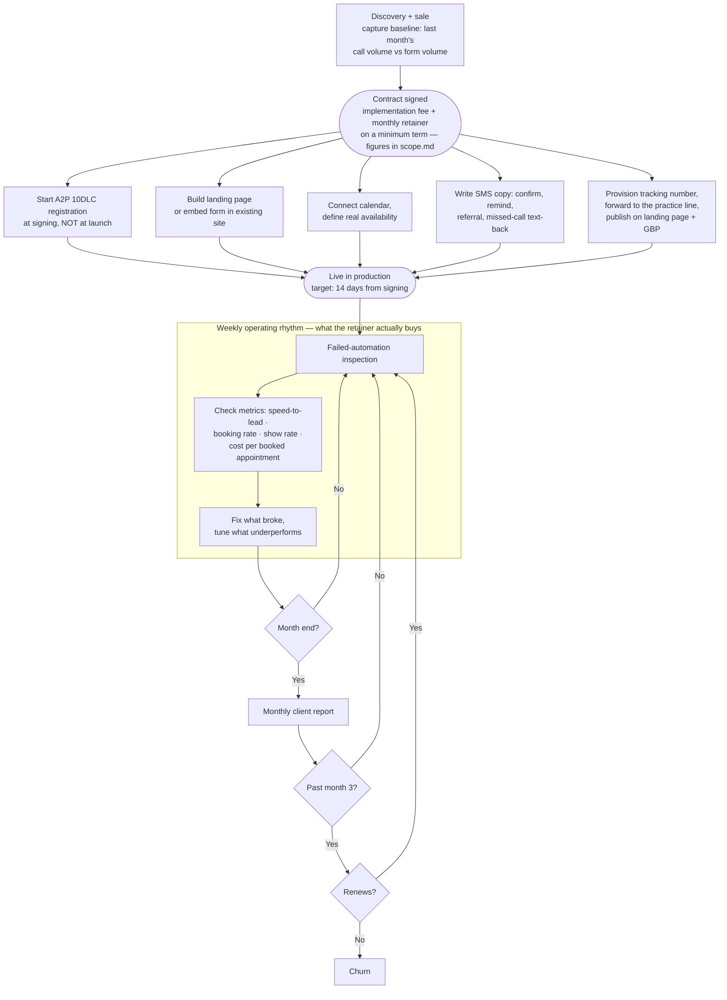

# Product flows

Three views of the same product at descending altitude: what the patient experiences, what we install, and what we do every week to keep it running. Source of truth for the product's shape — pitch decks, landing page copy, and specs should be derivable from here rather than reinventing the story each time.

Diagrams are Mermaid, so they render on GitHub and in VS Code preview with no build step. Edit the text, not an image.

**These diagrams are a *view* of scope, not the declaration of it.** `scope.md` owns what's in and out of the current offer version. If a diagram here implies coverage `scope.md` doesn't list, the diagram is wrong.

**This file is never versioned or frozen** — it always describes the current offer, and there is no `flows-v1.md`. Its three layers move on three different clocks: Layer 1 tracks the offer, Layer 2 tracks the code, Layer 3 tracks operations. Historical scope records live in `internal/releases/scope-v<N>.md`, which are self-contained and don't depend on this file.

**Red dashed nodes mark honest gaps** — places where v1 does nothing and we should say so out loud rather than let a diagram imply coverage we haven't built.

---

## Layer 1 — Patient journey

What a patient actually experiences. This is the layer that maps most directly onto landing page copy and the sales conversation, because it is the thing we sell.

**Where the value sits.** Everything between *lead captured* and *shows up* is the product. We do not create the demand on the left, and we do not touch the clinical work inside the visit.

**Calls are in v1, but only the ones routed through us.** The tracking number forwards to the practice's line; missed-call text-back fires when nobody picks up. Exact boundaries — including what's excluded and why — are in `scope.md`.

**The reason calls can't wait for v2 is the denominator, not the feature.** Speed-to-lead, booking rate, and cost per booked appointment all divide by "inquiries." A form-only v1 computes every headline metric on a partial denominator, and it flatters us — form leads that got an instant SMS convert well. Handing an owner-operator a booking rate that ignores the calls they know they missed is how the first monthly report loses credibility, and the first report is what the month-3 renewal turns on. Call data also has no backfill: calls we didn't count are gone permanently.

**The residual gap is real and worth saying out loud.** Patients who dial the practice's main number directly are invisible to us. We publish the tracking number on the landing page and Google Business Profile, so we cover the channels we're accountable for — but the practice's own line stays untouched and unmeasured. That's a deliberate trade: rerouting a practice's primary revenue channel two weeks into a relationship is the highest-risk thing we could ask for, and the fallback if our number ever breaks is that their old one still rings.

---

## Layer 2 — What we install

The system a signed practice actually gets, and where our boundary sits. One multi-tenant app we own and operate, so an added practice costs close to nothing at the margin.

**No PHI crosses the boundary.** We hold contact details and booking preferences. Everything clinical stays in the practice's PMS, which keeps the first cohort out of HIPAA scope and is a constraint on every spec until deliberately revisited.

**A2P 10DLC gates the SMS rail, not the voice one.** No registered number means no SMS, and no SMS means there is no product — which is why Layer 3 starts registration at signing. The tracking number is a Twilio voice number and needs no 10DLC, so adding call capture does not extend the critical path.

**Missed-call text-back is nearly free once the SMS rail exists.** It reuses the Twilio account, the same 10DLC registration, the existing templates, and the automation scheduler. The marginal build is a forwarding rule plus a status callback on `no-answer` that sends a template we already wrote. Keep STOP language in it: an inbound caller supplies the consent basis, but the opt-out still has to be there.

**The dashboard is not a nice-to-have.** It is the artifact the retainer is sold against. If per-client metrics aren't native to the platform, the monthly report becomes manual work that scales linearly with clients and eats the margin the multi-tenant bet is supposed to produce.

---

## Layer 3 — Client lifecycle

What happens on our side, from first conversation to the renewal decision. This is the layer that justifies the retainer, and the one that is easiest to underestimate.

**Onboarding runs in five parallel tracks, and A2P is still the long pole.** The other four are work we control and can compress; registration is a queue we wait in. Objective 2 — every client live within 14 days of signing — fails on that step or not at all. Provisioning the tracking number takes minutes and needs no 10DLC, so it adds a track without moving the deadline.

**Discovery captures the call-vs-form baseline on every deal.** It's one question — how many new-patient calls and form submissions did you get last month — and most practices can pull call volume from their phone provider on the spot. It's a step in the process rather than a task someone has to remember, and it's the data that settles open question 2.

**The renewal decision is the whole experiment.** Percentage of clients still paying past month 3 is the key success metric because practices don't keep paying a four-figure monthly retainer for something that isn't producing. Target for the first cohort is 2 of 3.

---

## Open questions

Genuinely undecided in `sequence-bridge.md` and `product.md`. Each one changes the diagrams above.

1. **What do we do about the PMS?**

   **What it is.** The practice management system is the operational core of a dental practice — Dentrix and Eaglesoft dominate the independent market, with Open Dental, Curve, Denticon, and CareStack behind them. It holds patient records, clinical charting, insurance claims, billing, and — the part that matters to us — **the appointment book**. Dental scheduling is not a simple calendar: appointments are assigned to a specific operatory (chair) and provider, with lengths that vary by procedure type.

   **Practically every practice has one.** Insurance claims and clinical record-keeping require it. This is not a system some practices skip.

   **The problem is bigger than we first wrote it.** We framed this as "how does a booking get *into* the PMS." The harder half is reading *out* of it. Layer 2 draws "practice calendar — the real availability" as a system separate from the PMS. In dental that is usually false: **the calendar is the PMS**. Without a read path we don't actually know real availability, and "booking against the practice's real availability" is a claim we currently can't support.

   **The risk isn't extra work, it's double-booking.** If we book a patient into a shadow calendar while the front desk books someone else into that slot in the PMS, we've created a real conflict — a patient arrives to no chair. That is materially worse than adding admin work: it damages the practice in front of its own patient and ends the relationship.

   **Options, roughly in order of cost:**

   - **Request-to-book.** We capture the lead and reply instantly with proposed times; the front desk confirms in the PMS and we confirm to the patient. Zero integration, completely honest, and speed-to-lead is still solved. But the booking isn't instant and a human sits in the path — which is the thing we sell against.
   - **Hold slots.** The practice reserves a small number of new-patient slots per day, blocked in the PMS so nobody else takes them, and we own that inventory exclusively. Instant booking becomes real, double-booking is structurally impossible, and transcription is bounded to a few appointments a day that we send as one daily digest. **This is the best v1 answer.**
   - **Middleware.** Vendors sell a single API across several dental PMSs — Sikka is the long-standing one, and NexHealth's Synchronizer is another. Real availability and real writeback, at a per-practice monthly cost, plus a vendor dependency. Note that NexHealth also competes with us for this budget.
   - **Direct integration, Open Dental first.** Open Dental is the most integration-friendly of the common systems. Cheapest real integration, but it constrains who we can sell to.

   **Should we target practices without a PMS?** No — that set is effectively empty, and a practice without one is not a practice we want as a pilot. But the useful version of the instinct is to **qualify on *which* PMS**. Add PMS brand to the discovery questionnaire alongside the call-volume baseline. If the first cohort clusters on one system, that picks the v1.1 integration target for free and costs us nothing to learn.

   **Recommendation.** Hold slots for v1, no integration. Say the transcription step out loud during the sale and bound it explicitly. Capture PMS brand on every discovery call.

   *Vendor specifics above come from general knowledge, not a current survey — verify integration terms and middleware pricing before committing to any of it.*

2. **How much of the phone channel does v1 need?** *Decided 2026-08-10, pending confirmation.* v1 includes two phone capabilities — a tracking number that forwards to the practice's line, and missed-call text-back. Call answering and recording stay out. This resolves the contradiction where `product.md` led its key-problems list with unanswered calls while the build deferred any coverage of them.

   The decision rests on an assumption we have not yet measured: that phone is the majority inquiry channel for single-location dental. Baseline capture is now part of discovery (Layer 3), and the confirmation is tracked in `roadmap.md` under 2026-08.

   **What would change our mind:** if calls turn out to be a small minority of inquiries across the first cohort, drop the tracking number and ship form-only — the argument for calls is volume and denominator integrity, and both collapse if the volume isn't there. If instead the dominant loss is unanswered calls to the practice's *main* line, then the residual gap in Layer 1 becomes the priority and we revisit either number porting or call answering.

3. **What happens after a no-show?** Reminders reduce them; they don't eliminate them. Show rate is a metric we report on, so we'll be handing clients a number with no lever attached to it.

4. **Where does a referral land, and is it attributed?** The referral ask is the fourth pillar of the sequence, but the return path isn't defined. If a referred patient enters through the same form with no tag, we can't prove the referral component produced anything — and unprovable value is the first thing cut at renewal.

5. **Where does cost-per-booked-appointment get its cost input?** We don't run ads and don't own lead volume, so the spend figure has to come from the practice. Worth confirming they'll share it before we promise the metric.
