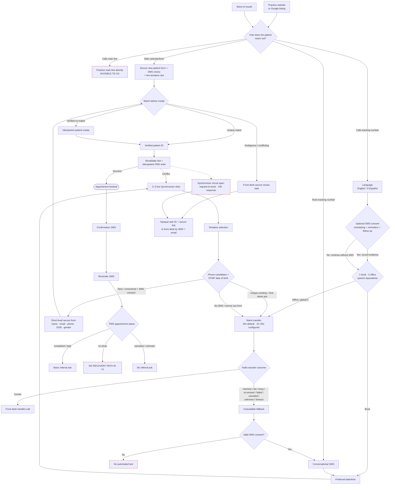
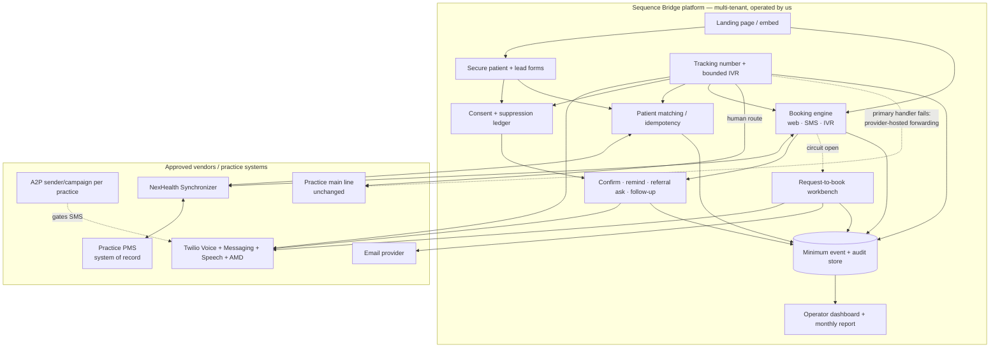
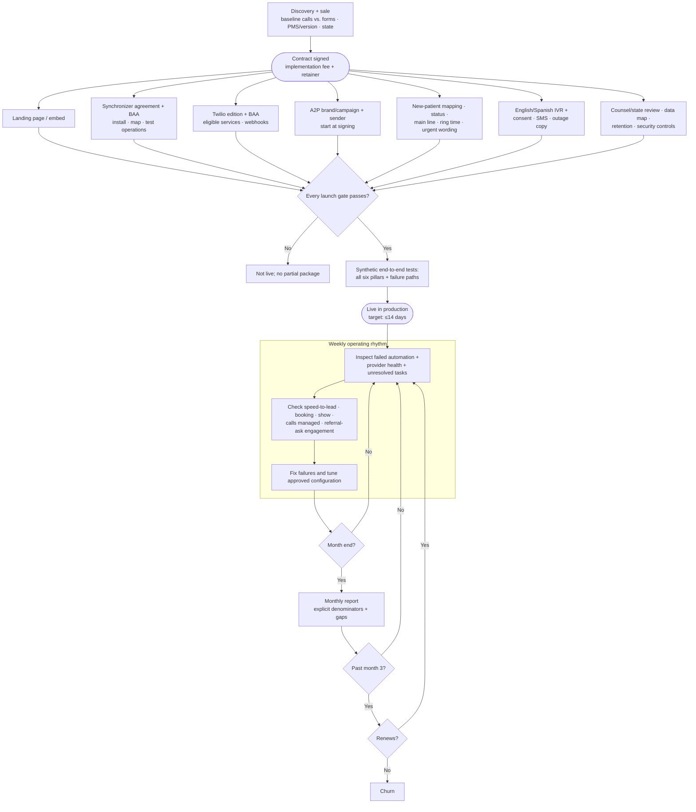

# Product flows

Three views of the same v1 product: what the patient experiences, what we install, and what we operate. `scope.md` owns the current offer; these diagrams explain it. If a diagram implies different coverage, the diagram is wrong.

Mermaid source is edited directly. Red dashed nodes mark honest gaps or fallback states.

---

## Layer 1 — Patient journey

**Booking is a PMS fact, not a message.** A selected slot is tentative until the patient identity step completes, the slot is revalidated, and the PMS write succeeds. Patient creation and appointment creation have separate idempotency protection.

**Phone is candidate discovery, not identity proof.** Caller ID may locate possible records but never selects one. DTMF date of birth must reduce the set to one candidate before the IVR says only the first name. A verified existing patient goes to the office because v1 exposes one new-patient visit, not existing-patient self-service.

**Consent precedes automated text.** The IVR asks immediately after language selection. Declining cannot block booking or office transfer, but it means an abandoned call cannot receive a text-back. The consent event stores the practice, number, call ID, time, language, disclosure version, response method/value, message subjects, and current state.

**Speech is bounded but real.** Twilio speech recognition can produce a transient raw `SpeechResult`. Sequence Bridge uses it in memory for the approved English/Spanish commands and bounded date/time or numeric selections, then stores only normalized results. Raw call audio and raw speech are absent from our persistence and logs.

**The main-line gap remains.** Calls made directly to the practice's line are invisible and excluded from “calls managed through Sequence Bridge.” The tracking number covers the landing page and Google Business Profile, the channels we manage.

---

## Layer 2 — What we install

**Minimum-data boundary.** Scheduling and messaging may be PHI even though v1 prohibits clinical intake. Persisted data is limited to identity/contact fields, date of birth, the PMS-required gender value, consent/suppression evidence, the configured generic appointment type, scheduling preferences/logistics/status, normalized IVR results, provider references, delivery/call events, tenant ownership, and audit fields. Clinical details, charts, insurance, billing, recordings, raw speech/transcripts, and unrestricted notes do not belong in the platform.

**Production is contract- and configuration-gated.** Twilio requires the qualifying commercial edition, executed BAA, HIPAA-enabled eligible-service configuration, A2P approval, consent/opt-out evidence, and signed webhooks. Synchronizer requires exact PMS/version and operation tests, commercial terms, BAA, support path, and completed/kept status support. Hosting, logging, monitoring, analytics, support, and backup paths are in the same data-flow review.

**Synchronizer fails closed for booking.** Three transient failures in two minutes or one auth/permission failure opens the tenant circuit. All channels stop showing live slots and create request-to-book. The patient is acknowledged immediately and promised a response within 24 clock hours; notifications carry only an opaque task ID and secure link. Recovery checks back off at 1, 2, 5, then 10 minutes and close after three successes. Queued requests never replay automatically.

**Twilio callbacks are idempotent.** Delayed or reordered AMD/call/message callbacks cannot bridge after fallback, duplicate a task, send a second follow-up, or create another booking.

---

## Layer 3 — Client lifecycle

**Launch is all-or-nothing.** The referral ask is implemented after the core booking/transfer/reminder/reporting paths but must still pass before the first client is live. A reliable completed/kept status is part of qualification; recurring front-desk work is not an acceptable substitute.

**The 14-day target has real long poles.** A2P, Twilio BAA/account readiness, Synchronizer provisioning, exact PMS tests, practice approvals, and state/compliance review begin as early as possible. The target never overrides a failed production gate.

**The report proves only what v1 can attribute.** It reports the managed-channel funnel and referral-ask engagement, not direct main-line calls or referred bookings/shows. Cost per booked appointment appears only when the practice supplies spend.

---

## Resolved contracts and remaining product gaps

1. **PMS:** Synchronizer is the only normal path. Initial targets are Dentrix, Eaglesoft, Open Dental, Curve Hero, and Dentrix Ascend, subject to exact operation/version qualification. Hold slots are retired.
2. **Patient:** phone is candidate lookup only; DTMF DOB precedes first-name confirmation; new-patient identity uses the secure form; ambiguous records are never auto-merged.
3. **Phone:** every v1 client receives the bounded bilingual IVR, early optional SMS consent, deterministic warm transfer, one consented follow-up, and provider-hosted voice fallback.
4. **Speech:** transient Twilio recognition is in; raw audio/transcript persistence and open-ended conversation are out.
5. **Referral:** the basic completed-visit ask is in and measured through click/reply; booking/show attribution is v2.
6. **No-show recovery:** not in v1 even though show rate is reported.
7. **Cost input:** practice-supplied spend is required before cost per booked appointment can be shown.
